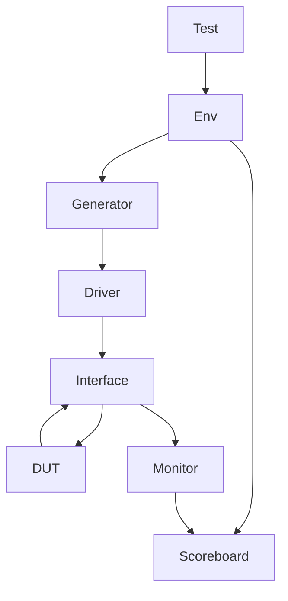

# 🔍 ALU Verification Project

  
  


---

## 📋 Table of Contents
- [🎯 Design Specifications](#-design-specifications)
- [🔧 Operations](#-operations)
- [🏗️ Testbench Architectures](#-testbench-architectures)
- [🧪 Test Cases](#-test-cases)
- [🛠️ Tools Used](#-tools-used)
- [🚀 Getting Started](#-getting-started)
- [📊 Verification Metrics](#-verification-metrics)
- [🧩 Future Work](#-future-work)
- [👤 Author](#-author)
- [📄 License](#-license)

---

## 🎯 Design Specifications

| Signal   | Description              | Width    |
|----------|--------------------------|----------|
| `clk`    | Input clock signal       | 1-bit    |
| `reset`  | Asynchronous reset       | 1-bit    |
| `Opcode` | Operation selector       | 2-bit    |
| `A`      | Input A (2's complement) | 4-bit    |
| `B`      | Input B (2's complement) | 4-bit    |
| `C`      | Output (2's complement)  | 5-bit    |

---

## 🔧 Operations

| Opcode | Operation     | Description               |
|--------|---------------|---------------------------|
| `00`   | Add           | A + B                     |
| `01`   | Subtract      | A - B                     |
| `10`   | Bitwise NOT   | ~A                        |
| `11`   | Reduction OR  | OR all bits of B (`|B`)   |

---

## 🏗️ Testbench Architectures

### ➤ SystemVerilog Class-Based



### ➤ Cocotb (Python-Based)

```mermaid
flowchart LR
    Python[Test Generator (Python)] --> GPI
    GPI --> Simulator[Verilog DUT]
    Simulator --> GPI
    GPI --> Python[Self-Checking and Reporting]
```

- Uses Python test routines to drive and monitor the Verilog DUT
- Supports asynchronous reset checks, boundary values, and functional scenarios
- Generates logs and reports for result tracking

---

## 🧪 Test Cases

### 🔁 Reset Tests
- ✅ Assert reset and confirm output `C = 0`
- ✅ Release reset and confirm normal functionality resumes

### ➕ Arithmetic Tests

| Test Case            | A   | B   | Opcode | Expected Result |
|----------------------|-----|-----|--------|-----------------|
| MAXNEG + MAXNEG      | -8  | -8  | 00     | -16 (overflow)  |
| MAXPOS + MAXNEG      | +7  | -8  | 00     | -1              |
| Zero Subtraction     |  0  |  0  | 01     | 0               |

### 🧠 Logical Tests
- ✅ Bitwise NOT with boundary values (`-8`, `+7`, `0`)
- ✅ Reduction OR with all-zeros and various non-zero patterns

---

## 🛠️ Tools Used

- **Simulators:**  
  - QuestaSim  
  - Xcelium  

- **Verification Frameworks:**  
  - Cocotb (Python-based co-simulation)  
  - SystemVerilog (UVM-like methodology)

- **Development Environments:**  
  - VS Code  
  - EDA Playground  

---

## 🚀 Getting Started

### ▶️ Cocotb Flow

```bash
# Install Cocotb
pip install cocotb

# Run Cocotb tests using Makefile
make SIM=questa
```

### ▶️ SystemVerilog Flow

```bash
# Compile and simulate using QuestaSim
vsim -do "run -all" tb_alu
```

---

## 📊 Verification Metrics

- ✅ Error Counter: `0`  
- ✅ Correct Operations Counter: All Passed  
- ✅ Boundary Coverage: **100% Achieved**
- ✅ Code Coverage: **100% Achieved**

---

## 🧩 Future Work

- 🔍 **Add functional coverage** to quantify verification completeness across opcode/input combinations  
- ✅ **Integrate SystemVerilog assertions** to enforce protocol correctness and catch corner-case bugs early  
- 📈 Improve scoreboard tracking and automation of pass/fail reporting

---

## 👤 Author

**Khaled Ahmed Hamed**  
- 💼 [LinkedIn](https://www.linkedin.com/in/eng-khaled-ahmed-hamed)  
- 📧 khalid1422003123@gmail.com  

---

## 📄 License

This project is licensed under ADI Summer Internship
