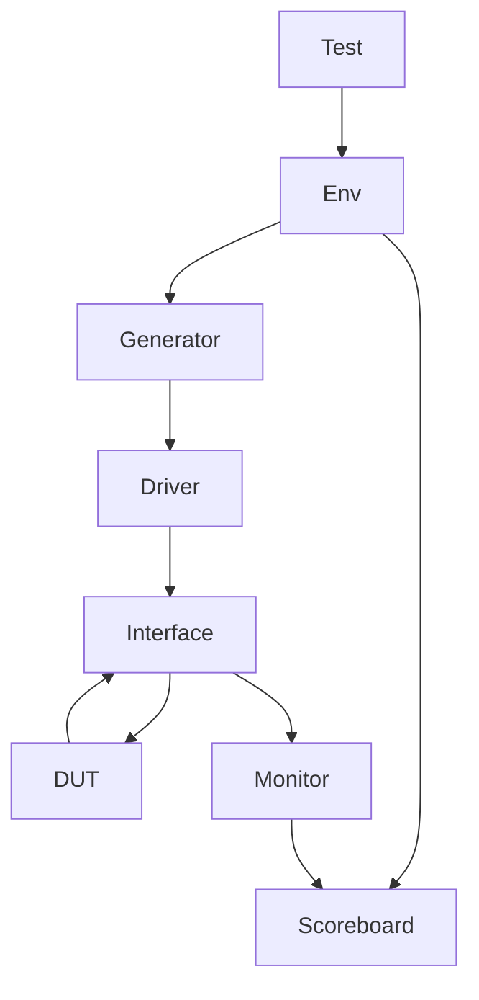
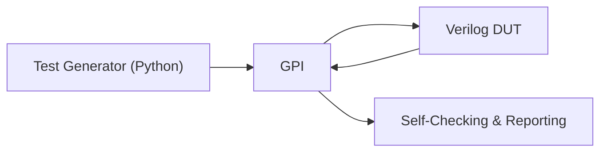

# 🔍 ALU Verification Project

  
  


---

## 📋 Table of Contents

- [🎯 Design Specifications](#🎯-design-specifications)  
- [🔧 Operations](#🔧-operations)  
- [🏗️ Testbench Architectures](#🏗️-testbench-architectures)  
- [🧪 Test Cases](#🧪-test-cases)  
- [🛠️ Tools Used](#🛠️-tools-used)  
- [🚀 Getting Started](#🚀-getting-started)  
- [📊 Verification Metrics](#📊-verification-metrics)  
- [🧩 Future Work](#🧩-future-work)  
- [👤 Author](#👤-author)  
- [📄 License](#📄-license)  

---

## 🎯 Design Specifications

| Signal   | Description              | Width |
|----------|--------------------------|:-----:|
| `clk`    | Input clock signal       | 1-bit |
| `reset`  | Asynchronous reset       | 1-bit |
| `Opcode` | Operation selector       | 2-bit |
| `A`      | Input A (2’s complement) | 4-bit |
| `B`      | Input B (2’s complement) | 4-bit |
| `C`      | Output (2’s complement)  | 5-bit |

---

## 🔧 Operations

| Opcode | Operation     | Description                |
|:------:|---------------|----------------------------|
| `00`   | Add           | A + B                      |
| `01`   | Subtract      | A – B                      |
| `10`   | Bitwise NOT   | ~A                         |
| `11`   | Reduction OR  | OR all bits of B (`|B`)    |

---

## 🏗️ Testbench Architectures

### ➤ SystemVerilog Class‑Based



### ➤ Cocotb (Python‑Based)



- Python routines drive and monitor the HDL DUT  
- Implements reset checks, boundary-value tests, and functional scenarios  
- Generates logs and results automatically  


## 🧪 Test Cases

### 🔁 Reset Tests

- ✅ Assert reset → expect `C = 0`  
- ✅ Release reset → expect normal operation  

### ➕ Arithmetic Tests

| Test Case            | A   | B   | Opcode | Expected |
|----------------------|:---:|:---:|:------:|:--------:|
| MAXNEG + MAXNEG      | -8  | -8  | `00`   | -16 (overflow) |
| MAXPOS + MAXNEG      | +7  | -8  | `00`   | -1         |
| Zero Subtraction     | 0   | 0   | `01`   | 0          |

### 🧠 Logical Tests

- ✅ Bitwise NOT at boundaries (`-8`, `+7`, `0`)  
- ✅ Reduction OR with all zeros and mixed bits  

---

## 🛠️ Tools Used

- **Simulators:** QuestaSim, Xcelium  
- **Frameworks:** Cocotb (Python), SystemVerilog (UVM‑like)  
- **Editors:** VS Code, EDA Playground  

---

## 🚀 Getting Started

### ▶️ Cocotb Flow

```bash
pip install cocotb
make SIM=questa
```

### ▶️ SystemVerilog Flow

```bash
vsim -do "run -all" tb_alu
```

---

## 📊 Verification Metrics

- ✅ Error counter: 0  
- ✅ Correct operations: all passed  
- ✅ Boundary coverage: **100%**  

---

## 🧩 Future Work

- ⚙️ Add **functional coverage** to ensure opcode-input combinations are fully exercised  
- 📌 Integrate **SystemVerilog assertions** for protocol and corner‑case checks  
- 📈 Enhance automation in scoreboard checks and reporting  

---

## 👤 Author

**Khaled Ahmed Hamed**  
- 💼 [LinkedIn](https://www.linkedin.com/in/eng-khaled-ahmed-hamed)  
- 📧 khalid1422003123@gmail.com  

---

## 📄 License

This project is licensed under **Analog Devices Inc.** Summer 2025' Digital IC Design Internship
